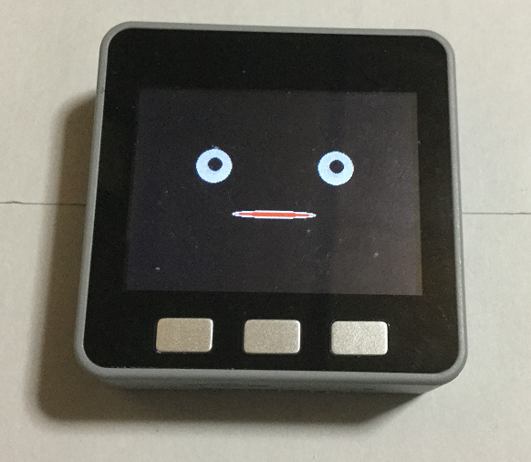

# M5Stack_Avator_AquesTalk_Test
M5StackでAvator表示とAquesTalkのテスト

meganetaaanさんのm5stack-avatorをベースにさせていただきました。  
オリジナルはこちら。 
An M5Stack library for rendering avatar faces <https://github.com/meganetaaan/m5stack-avator> 

---
   
### 必要な物 ###
* [M5Stack](http://www.m5stack.com/ "Title") (Grayで動作確認をしました。) 
* Arduino IDE (1.8.5で動作確認をしました。) 
* [Arduino core for the ESP32](https://github.com/espressif/arduino-esp32 "Title")
* [M5Stack Library](https://github.com/m5stack/M5Stack.git "Title")
* [AquesTalk pico for ESP32](http://blog-yama.a-quest.com/?eid=970188 "Title")  

